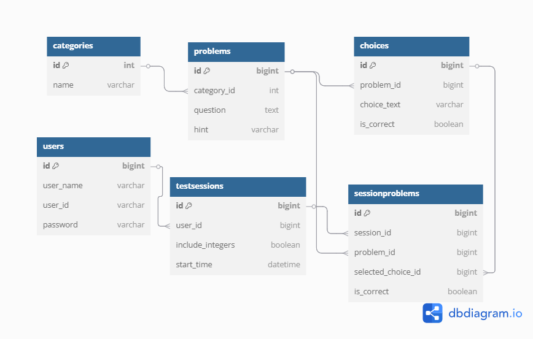

# MathOvercome

## 概要
このアプリは、高校数学の苦手分野を克服するための支援ツールです。
ユーザーは各分野ごとに出題される問題に取り組み、成績に応じたフィードバックを受けられます。

## コンセプト

このアプリは、Webアプリケーション開発に必要な技術を一通り学ぶことを目的として制作しました。  
特にバックエンドのSpring Bootを中心に、実践的なAPI設計・セッション管理・データベース連携などを経験するための題材として取り組んでいます。

また、自分が作れるアプリで誰かの役に立てるものは何かを考えた結果、数学学習に困っている高校生を支援できるアプリを作ろうと考えました。

参考書と組み合わせて使える補助的なツールとして、苦手分野の分析・フィードバック・学習履歴の可視化を提供し、受験対策にも役立つことを目指して、長期的に改善を続けていきます。

## 🌐 アプリURLと動作環境について

[https://math-overcome.vercel.app](https://math-overcome.vercel.app)

このURLからアプリを体験できますが、以下の点にご注意ください：

- このアプリは無料のホスティングサービス（Render, Vercel）を使用しているため、初回アクセス時にサーバーの起動に数十秒かかることがあります。
- **iPhone（Safari）など一部のスマートフォンブラウザでは、セキュリティ制限によりログイン後のセッションが維持されないことがあります。**
  - これは「クロスオリジンのCookie送信」がSafariで制限されているためで、PCブラウザ（Chrome/Edgeなど）では正常に動作します。
- **今後は、JWTを導入することで、スマートフォンやクロスドメイン環境でも安定したセッション維持が可能な構成に改善予定です。**

## 利用技術
- フロントエンド: Next.js 15.3.1
- バックエンド: Spring Boot 3.4.5
- データベース: MySQL 8.0.41
- デプロイ: Vercel / Render / Railway
- その他: 
   - Spring Data JPA  
   - Bootstrap 5.3.0

## 主な機能
- ユーザー登録 / ログイン機能
- 数学の問題を分野ごとに出題
- 回答履歴を記録し、結果表示
- セッション保持によるログイン状態管理

## 工夫した点
- HTMLを返していたエンドポイントをJSONに変更し、RESTfulなAPI設計にリファクタリング
- Repository層でEntityを取得し、DTOに変換して返却する一般的な構成を採用（Controller-Service-Repositoryの分離）
- パフォーマンスが課題となる処理には、JPAではなくネイティブSQLを活用して高速化
- サーブレットフィルター（`LoginCheckFilter`）によって未ログインユーザーのリクエストをブロック
- 認可チェックとしてユーザーIDの照合により、他人のセッション情報を閲覧・操作できないよう制御

## 今後の改善点
- Spring Securityを導入し、JWT認証およびOAuthログインによるセキュリティ強化を実施予定
- JOIN FETCHを用いたクエリ最適化により、N+1問題を回避し、DBアクセスを効率化
- マイページ表示に特化したネイティブSQLおよびJOIN最適化により、セッション・カテゴリ単位の集計処理を高速化
- Entityをそのまま返す設計からDTOを経由する設計へ移行し、必要なカラムのみを返却することで通信量を削減
- ModelMapperを導入し、EntityとDTO間のマッピング処理を簡略化
- 数学の単元・出題数の柔軟なカスタマイズ、学習結果に応じたフィードバック機能の実装

## ER図

## 使い方

1. このリポジトリをクローン  
2. `frontend` フォルダで `npm install && npm run dev` を実行  
3. `backend` フォルダで `./mvnw spring-boot:run` を実行  

※ MySQLの設定が必要です。  
※ また、アプリの正常な動作には `problems` および `choices` テーブルに初期データが登録されている必要があります。  

現在は初期データの投入機能を準備中のため、**今すぐローカルでの動作確認は難しい場合があります**。  
そのため、完成版のデプロイ公開をお待ちいただくことをおすすめします。

